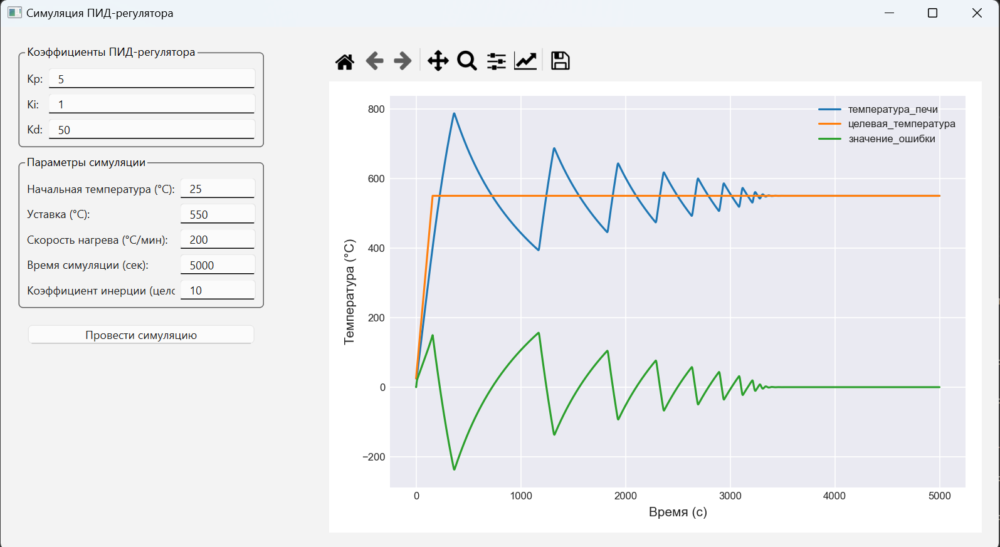

# PIDSimulations

Приложение для симуляции ПИД-регулятора с продвинутым термическим моделированием.

## Описание

PIDSimulations - это desktop-приложение на PyQt6, предназначенное для моделирования и анализа поведения ПИД-регулятора в системах температурного контроля. Приложение позволяет настраивать параметры регулятора и симуляции, визуализировать результаты в реальном времени. Изменяя параметр инерции системы и скорости нагрева можно моделировать поведение разных систем и влияние коэффициентов регулирования на управляющее воздействие.



## Основные возможности

- Настройка коэффициентов ПИД-регулятора (Kp, Ki, Kd)
- Задание параметров симуляции (начальная температура, уставка, скорость нагрева)
- Учет тепловой инерции системы 
- Визуализация процесса в реальном времени
- Интерактивные графики с возможностью масштабирования
- Удобный пользовательский интерфейс

## Теория: ПИД-регулятор

ПИД-регулятор (пропорционально-интегрально-дифференциальный регулятор) описывается следующим уравнением:

$$
u(t) = K_p e(t) + K_i \int_0^t e(\tau) d\tau + K_d \frac{de(t)}{dt},
$$

где:
- u(t) — выходная величина регулятора;
- e(t) = r(t) - y(t) — ошибка, разница между уставкой r(t) и фактическим значением y(t);
- Kp — пропорциональный коэффициент;
- Ki — интегральный коэффициент;
- Kd — дифференциальный коэффициент.

Каждая из составляющих выполняет свою функцию:
1. **Пропорциональная часть:** реагирует на текущую ошибку.
2. **Интегральная часть:** компенсирует накопленные ошибки.
3. **Дифференциальная часть:** учитывает скорость изменения ошибки, предотвращая перерегулирование.

## Использование

1. Запустите приложение.
2. Установите коэффициенты ПИД-регулятора.
3. Задайте параметры симуляции.
4. Нажмите "Провести симуляцию".
5. Наблюдайте за результатами на графике.

## Системные требования

- Windows 10 или новее
- 4 GB RAM
- 100 MB свободного места на диске

## Установка

1. Скачайте последнюю версию приложения из раздела Releases.
2. Распакуйте архив в удобное место.
3. Запустите `pid-sim.exe`.

## Разработка

### Требования для разработки

- Python 3.8 или новее
- PyQt6 6.7.1
- numpy
- matplotlib

### Установка зависимостей

```bash
poetry install

```

### Запуск из исходного кода

```bash
poetry run pid-sim
```

### Сборка

```bash
poetry run pyinstaller --name=pid-sim --onefile --windowed --add-data "src/*;src"  --hidden-import PyQt6.QtCore --hidden-import PyQt6.QtGui  --hidden-import PyQt6.QtWidgets  --hidden-import numpy --hidden-import matplotlib --hidden-import core --hidden-import gui src/gui/main.py
```

## Лицензия

MIT License
